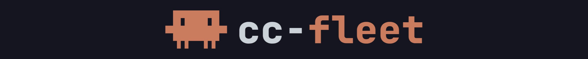

# cc-fleet

**spawn any vendor LLM — DeepSeek · GLM · Qwen · Kimi … — as real Claude Code teammates**

---

<div align="center">

[](https://github.com/ethanhq/cc-fleet/releases)
[](https://www.npmjs.com/package/cc-fleet)
[](https://github.com/ethanhq/cc-fleet/releases)
[](LICENSE)
[](README_zh.md)

</div>

Vendor workers are **real Claude Code teammates** — driven exactly like native ones — with
the LLM backend swapped to any provider that exposes an Anthropic-compatible API. Your main
session's own auth (OAuth subscription or API key) is untouched; vendor workers bill the
vendor API key via `apiKeyHelper`, and the key never enters env, argv, or shell history.

`cc-fleet` is a small Go CLI plus one Claude Code skill. The CLI manages per-vendor
profiles, dispatches API keys via `apiKeyHelper`, and spawns teammate sessions in tmux
panes. The skill teaches Claude Code *when* to delegate work to those teammates.


## Requirements

- **Claude Code** (the `claude` CLI) on your PATH.
- **tmux** — vendor teammates run in tmux panes.
- **Linux or macOS**, amd64 or arm64 (no Windows).
- For **teammate** mode, Claude Code's agent-teams must be enabled (the `SendMessage` /
  `TeamCreate` tools). The one-shot **subagent** mode needs no agent-teams.

## Quick Install

**One-line (recommended)**
```bash
curl -fsSL https://raw.githubusercontent.com/ethanhq/cc-fleet/main/install.sh | sh
```
Downloads the prebuilt binary, installs `cc-fleet` + the `ccf` alias, and adds the
skill via the Claude Code plugin. Flags (after `| sh -s --`): `--skill plugin|global|none`,
`--scope user|project|local`, `--prefix DIR`, `--version vX.Y.Z`.

**npm**
```bash
npm install -g cc-fleet      # or run once: npx cc-fleet
```

**go install**
```bash
go install github.com/ethanhq/cc-fleet/cmd/cc-fleet@latest
ln -sf "$(go env GOPATH)/bin/cc-fleet" "$(go env GOPATH)/bin/ccf"   # optional ccf alias
```

**Prebuilt tarball** — download from [Releases](https://github.com/ethanhq/cc-fleet/releases):
```bash
tar -xzf cc-fleet-*.tar.gz && cd cc-fleet-*/ && ./install.sh
```

**From source**
```bash
git clone https://github.com/ethanhq/cc-fleet.git && cd cc-fleet && make install
```

## Getting Started

```bash
# 1. create the config tree at ~/.config/cc-fleet/
cc-fleet init

# 2. register a vendor — pipe the key on stdin so it never lands in argv / shell history
printf '%s' "$DEEPSEEK_API_KEY" | cc-fleet add deepseek \
  --base-url https://api.deepseek.com/anthropic \
  --models-endpoint https://api.deepseek.com/v1/models \
  --default-model deepseek-chat \
  --secret-backend file --secret-ref deepseek.key --api-key-stdin

# 3. health-check
cc-fleet doctor
```

Then just ask Claude Code in plain language — the skill routes the request:

> *"Spawn a deepseek teammate to refactor the parser package, then report back."*
> &nbsp;&nbsp;→ a long-lived vendor **teammate** in a tmux pane.
>
> *"Use deepseek to summarize this 2,000-line log file."*
> &nbsp;&nbsp;→ a one-shot **subagent**, result returned inline.

Claude decides teammate vs subagent, spawns the vendor worker, and coordinates it —
your main session keeps using its own Anthropic auth the whole time.

## How it works

It captures Claude Code's own spawn template (a *fingerprint*), swaps in a vendor profile,
and launches a real `claude` process in a tmux pane — same full tool stack, just a
different model backend. The vendor key is fetched lazily through the profile's
`apiKeyHelper` (`cc-fleet keyget`), so it never enters the environment, argv, or shell
history. Your main session's auth is never touched; only the teammate panes bill the vendor.

## The skill

The binary is just the CLI. To teach Claude Code *when* to delegate, install the skill
via the plugin (the one-line installer does this by default):
```bash
claude plugin marketplace add ethanhq/cc-fleet
claude plugin install cc-fleet@ethanhq
```

## License

[Apache-2.0](LICENSE).
