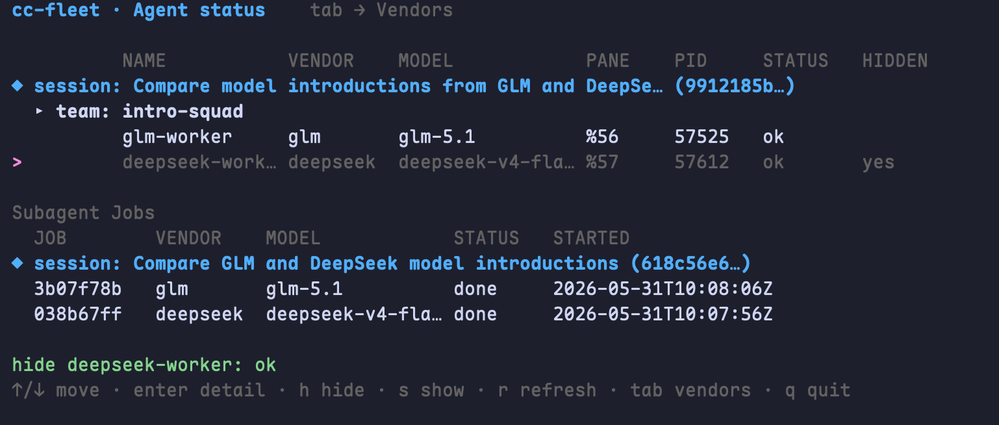

# cc-fleet

**🤖 Spawn any vendor LLM — DeepSeek · GLM · Qwen · Kimi · MiniMax … — as real Claude Code teammates or ⚡ one-shot subagents 🚀**

<div align="center">

[](https://github.com/ethanhq/cc-fleet/releases)
[](https://www.npmjs.com/package/cc-fleet)
[](https://github.com/ethanhq/cc-fleet/releases)
[](LICENSE)
[](README_zh.md)

</div>

---

<div align="center">


</div>

Vendor workers are **real Claude Code teammates** — driven exactly like native ones — with
the LLM backend swapped to any provider that exposes an Anthropic-compatible API. Your main
session's own auth (OAuth subscription or API key) is untouched; vendor workers bill the
vendor API key via `apiKeyHelper`, and the key never enters env, argv, or shell history.

`cc-fleet` is a small Go CLI plus one Claude Code skill. The CLI manages per-vendor
profiles, dispatches API keys via `apiKeyHelper`, and spawns teammate sessions in tmux
panes. The skill teaches Claude Code *when* to delegate work to those teammates.

## Requirements

- **Claude Code** (the `claude` CLI) on your PATH.
- **tmux** — vendor teammates run in tmux panes.
- **macOS or Linux**, amd64 or arm64 — the tested platforms. Windows can in theory run
  the one-shot **subagent** mode, but it is untested.
- **Teammate** mode needs Claude Code's agent-teams enabled. Turn it on in your global
  `~/.claude/settings.json` and restart Claude Code (cc-fleet also nudges you on first run):
  ```json
  { "env": { "CLAUDE_CODE_EXPERIMENTAL_AGENT_TEAMS": "1" } }
  ```
  The one-shot **subagent** mode works without it.

## Quick Install

**One-line (recommended)**
```bash
curl -fsSL https://raw.githubusercontent.com/ethanhq/cc-fleet/main/install.sh | sh
```
Downloads the prebuilt binary, installs `cc-fleet` + the `ccf` alias, and adds the
skill via the Claude Code plugin. Flags (after `| sh -s --`): `--skill plugin|global|none`,
`--scope user|project|local`, `--prefix DIR`, `--version vX.Y.Z`.

**npm**
```bash
npm install -g cc-fleet      # or run once: npx cc-fleet
```

**go install**
```bash
go install github.com/ethanhq/cc-fleet/cmd/cc-fleet@latest
ln -sf "$(go env GOPATH)/bin/cc-fleet" "$(go env GOPATH)/bin/ccf"   # optional ccf alias
```

**Prebuilt tarball** — download from [Releases](https://github.com/ethanhq/cc-fleet/releases):
```bash
tar -xzf cc-fleet-*.tar.gz && cd cc-fleet-*/ && ./install.sh
```

**From source**
```bash
git clone https://github.com/ethanhq/cc-fleet.git && cd cc-fleet && make install
```

## Getting Started

Run `cc-fleet` (or the `ccf` alias) with no arguments to open the interactive TUI:

```bash
cc-fleet
```

In the TUI you register a vendor — give it a name, its Anthropic-compatible base URL, a
models endpoint, a default model, and paste the API key. The key is written `0600` under
`~/.config/cc-fleet/secrets/` and is **never** passed via argv or shell history.


The config tree is created automatically on first save, so there is no separate init step.
The TUI also lists your vendors, lets you edit them, and manage multiple keys per vendor.


Press `tab` to switch to the **Agent status** board — it shows every live teammate grouped by
session → team, with its vendor, model, pane, PID, health, and hidden state, plus a list of
subagent jobs. From here you can hide (`h`) / show (`s`) a teammate pane or refresh (`r`).



Once at least one vendor is registered, just talk to Claude Code in plain language. The
skill reads your request and picks how to run the work — there are two execution modes.

### Teammate mode — a long-lived vendor worker on your team

Ask for something ongoing or iterative ("spawn a deepseek teammate to refactor the parser
package, then report back") and the skill runs the vendor as a **real Claude Code agent-team
teammate**. Claude calls its native `TeamCreate`, cc-fleet launches the vendor's own `claude`
process in a tmux pane, and Claude then drives it with native `SendMessage` — exactly the way
it drives a native teammate. You assign tasks, it works and reports back, and the same
teammate stays alive across turns so you can keep handing it follow-ups. Run several at once
to fan work out in parallel. This mode needs Claude Code's agent-teams enabled. Throughout,
your main session keeps using its own Anthropic auth (OAuth or API key) — only the teammate
pane bills the vendor key, fetched lazily via `apiKeyHelper`.

Start from inside a tmux session so the teammates can split into panes alongside your lead:

```bash
tmux new-session -s cc-fleet
```


Above: your lead session on the left, with a `deepseek` and a `glm` vendor teammate running
in their own panes on the right — each a real `claude` process, driven by `SendMessage` and
reporting back exactly like native teammates.

### Without tmux — the teammate runs detached in the background

If you're **not** inside a tmux session, cc-fleet can't split your terminal, so it
transparently builds a **detached background tmux server** (`cc-fleet-swarm-<team>`) and runs
the teammate there. The pane is never shown in your foreground — the worker simply lives in
that background server. You still create, task, and read it entirely through native
`TeamCreate` / `SendMessage`, identical to the in-tmux case; the only difference is the pane
isn't on screen. If you want to watch it you can attach (`tmux -L cc-fleet-swarm-<team>
attach`), but you never have to. Same teammate semantics, just not in the foreground.

### Subagent mode — a one-shot headless call

For a single self-contained job ("use deepseek to summarize this 2,000-line log file"), the
skill runs a **subagent** instead: `cc-fleet subagent <vendor>` invokes the vendor model
headless and returns the result synchronously — **no pane, no team, and no agent-teams
required**. It's the right tool for one-off research/analysis and for batch fan-out of many
independent tasks. Long jobs can run with `--background` (polled via `cc-fleet
subagent-status`), multi-turn work resumes with `--resume`, and `--max-budget-usd` /
`--max-turns` bound the cost.

You don't choose the mode by hand — Claude decides teammate vs subagent from the nature of
the request, spawns the vendor worker, and coordinates it for you.

## How it works

It captures Claude Code's own spawn template (a *fingerprint*), swaps in a vendor profile,
and launches a real `claude` process in a tmux pane — same full tool stack, just a
different model backend. The vendor key is fetched lazily through the profile's
`apiKeyHelper` (`cc-fleet keyget`), so it never enters the environment, argv, or shell
history. Your main session's auth is never touched; only the teammate panes bill the vendor.

## The skill

The binary is just the CLI. To teach Claude Code *when* to delegate, install the skill
via the plugin (the one-line installer does this by default):
```bash
claude plugin marketplace add ethanhq/cc-fleet
claude plugin install cc-fleet@ethanhq
```

## License

[Apache-2.0](LICENSE).
