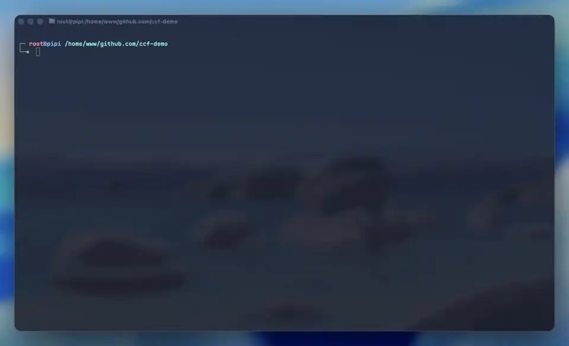
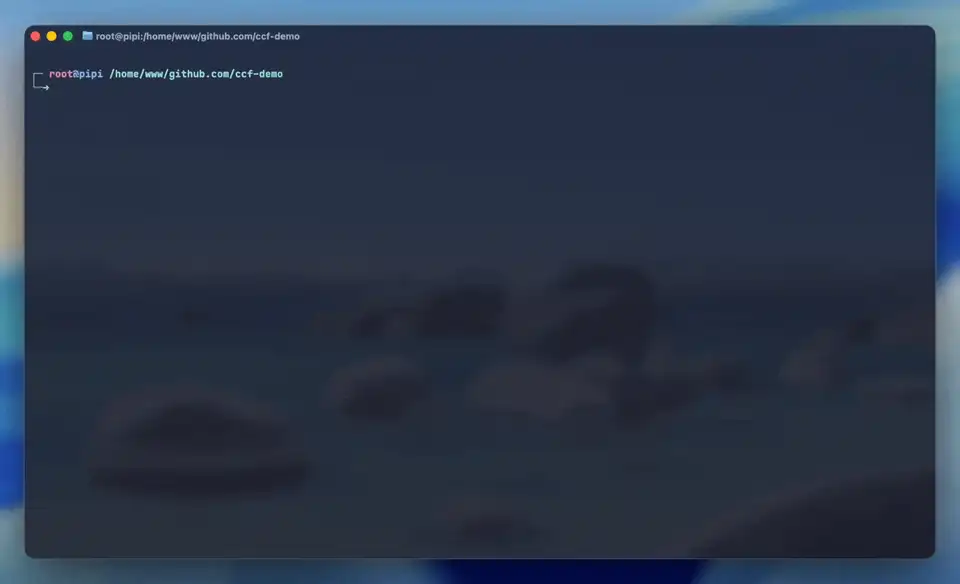
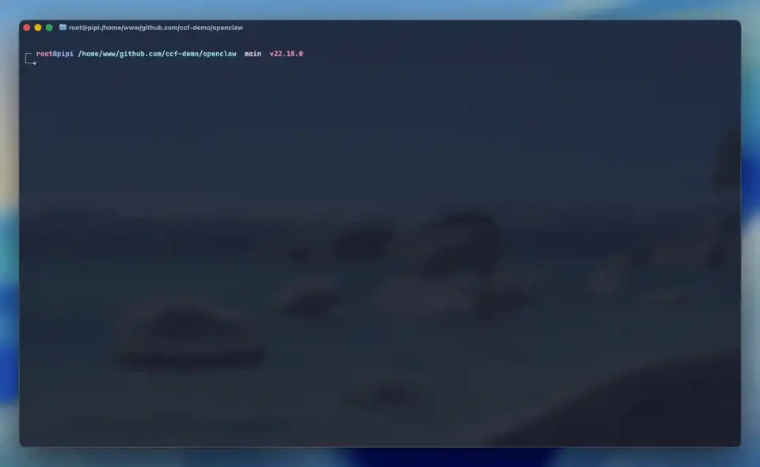
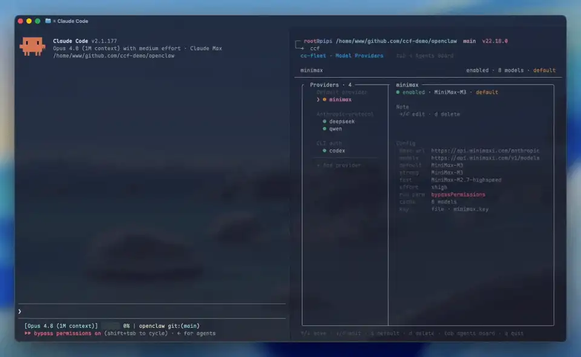
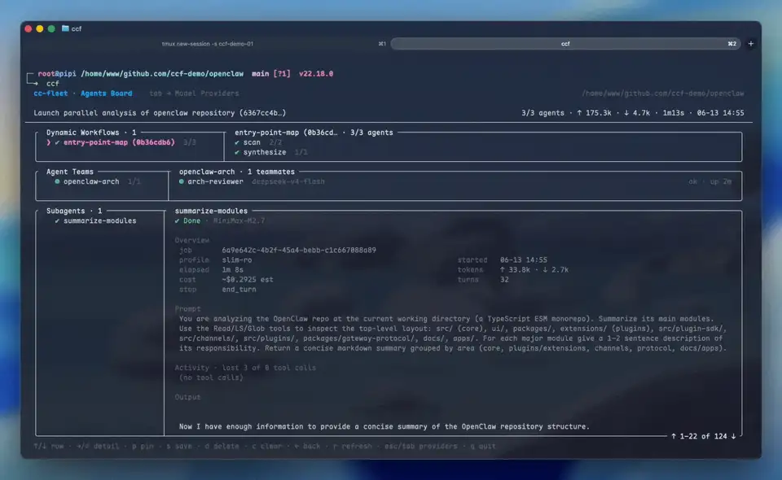

<h1 align="center">🚢 cc-fleet</h1>

<p align="center"><strong>🤖 为 Claude Code 的 ⚙️ Dynamic Workflow、👥 Agent Team、⚡ Subagent 接入任意第三方模型——从 DeepSeek · GLM · Kimi · Qwen……到你的 Codex 订阅,主会话原有认证不受影响;若没有 Claude 订阅,也能用任意 Provider 启动一个完整的 Claude Code 🚀</strong></p>

<div align="center">

[](https://github.com/ethanhq/cc-fleet/releases) [](https://www.npmjs.com/package/@ethanhq/cc-fleet) [](https://github.com/ethanhq/cc-fleet/releases) [](../LICENSE)

[English](../README.md) · **简体中文**

</div>

---

Claude Code 的多 agent 编排能力——Dynamic Workflow、Agent Team、Subagent——原本只能跑 Anthropic 自家的模型。cc-fleet 让任何提供 Anthropic 与 OpenAI 兼容 API 的模型,甚至你的 Codex 订阅,都能作为 Workflow leaf、长驻 Teammate 或一次性 Subagent 接入,由主会话直接调度,身份与能力都与原生 Claude Agent 一致。

每个第三方 worker 都是一个真实的 `claude` 进程,只是 LLM 后端换成了对应服务商,Claude Code 用驱动原生 agent 的方式驱动它即可。主会话自己的认证(OAuth 订阅或 API key)不受影响,第三方 key 绝不进入环境变量、argv 或 shell 历史——无泄漏风险。

上手两步:一键安装,配置一个 Provider。之后在 Claude Code 里用 `/workflow`、`/team`、`/subagent` 指定意图,或直接用自然语言描述任务——意图识别与 CLI 调用全部由 Claude 自行推理操作。

如果没有 Claude 订阅,`ccf run <provider>` 直接启动一个由该 Provider 驱动的交互式会话——还是熟悉的 `claude`,只是跑在对应的 Provider(供应商)模型上。

## 快速安装

**0. 先装 Claude Code**——cc-fleet 驱动的是官方 `claude` CLI,没装的话先装(PATH 上已有 `claude` 可跳过):

**macOS / Linux:**
```bash
curl -fsSL https://claude.ai/install.sh | bash
```
**Windows(PowerShell):**
```powershell
irm https://claude.ai/install.ps1 | iex
```

**1. 一键脚本装 cc-fleet(推荐)**——一条命令完成全部:下载并校验 CLI、写入 PATH(同时建立 `ccf` 别名,之后用 `ccf` 即可启动)、通过 marketplace 装好 Claude Code 插件(skill + 会话 hook),装完直接可用:

**macOS / Linux:**
```bash
curl -fsSL https://raw.githubusercontent.com/ethanhq/cc-fleet/main/install.sh | sh
```
**Windows(PowerShell):**
```powershell
irm https://raw.githubusercontent.com/ethanhq/cc-fleet/main/install.ps1 | iex
```

> 其他安装方式(npm / go install / Releases / 源码)、安装器覆盖参数、环境要求与维护,见 **[安装与维护](install.zh.md)**。

**常用命令:**

```bash
ccf                      # 唤起 TUI 交互面板
ccf doctor               # 体检:检查依赖、Provider、插件状态
ccf update               # 沿安装渠道自更新并刷新插件
ccf uninstall --all      # 连二进制、插件一起清空
```

装好后先运行 `ccf` 注册一个 Provider,即可开始委派。

## 快速上手
<table>
<tr>
<td width="50%" valign="top">
<div align="center">

**🔌 Provider 管理 - 输入 API Key 快速接入**



</div>

1. `ccf` 进入 TUI,选 Add provider
2. 选任意一家 Anthropic / OpenAI 兼容厂商
3. 填 API Key 与默认模型,可选配 effort 思考强度与 Claude 启动权限
4. 保存即用;列表里可加多个模型启停切换,`s` 设默认、`d` 删除
5. (按需)配 Codex:复用已有 OAuth,或现场登录(ccf 自持一份凭证)

</td>
<td width="50%" valign="top">
<div align="center">

**🖥️ ccf run - 用任意 Provider 跑 Claude Code**



</div>

1. `ccf run` 用默认 Provider 启动一个交互式 `claude`,`ccf run <provider>` 指定其中一家
2. 全套工具、完整 REPL;无需 Anthropic 订阅,不影响主会话登录状态
3. Linux / macOS / Windows 一条命令即开
4. 可选 `--model strong/fast` 选档、`--permission-mode` 定权限、`-- <参数>` 透传;进会话后也能切换——`/model` 换模型、`/effort` 调思考强度、`Shift+Tab` 切权限

</td>
</tr>
<tr>
<td width="50%" valign="top">
<div align="center">

**⚙️ Dynamic Workflow - 与原生 workflows 一致的编排 API**


</div>

1. `/workflow` 直接发起,或一句话交给 Claude:「deepseek 摸每个模块,glm 逐个出审计清单,gpt 汇总」
2. Claude 自动写成 JS 脚本、丢给独立的后台引擎(detached)跑——不花你主会话 token
3. 原生 `agent()` / `parallel()` / `pipeline()` 编排,`provider` 指派各家模型并行跑
4. `workflow wait` 阻塞到任务完成才退出——事件驱动、无需轮询;`--resume` 只补没跑完的 leaf
5. TUI 板实时显示每个 leaf 与 phase 的运行状态,`x` 暂停 / `r` 重跑单个 leaf 或整个 phase

</td>
<td width="50%" valign="top">
<div align="center">

**👥 Agent Team - tmux 分屏里的原生 Claude 多 Agent 协作**



</div>

1. `/team` 直接发起,或一句话交给 Claude:「开 glm 和 deepseek 两个 teammate,各自总结强项再对比」
2. Claude 调原生 `TeamCreate`,每个 Teammate 是真 `claude` 进程,在侧边的 tmux pane 实时工作
3. `SendMessage` 驱动,跨 Provider 混编、跨轮次持续追加任务
4. TUI 看板里可看每个 Teammate 的完整 inbox 与运行状态;`h` 收纳 / `s` 展示 pane、权限继承自 lead,可前台分屏或后台运行

</td>
</tr>
<tr>
<td width="50%" valign="top">
<div align="center">

**⚡ Subagent - 最轻量的一次性委派**



</div>

1. `/subagent` 直接发起,或一句话交给 Claude:「kimi、qwen、glm 三个 subagent 并行分到这三个文件」
2. 最轻的一条 lane:不开 pane、不建 team,Claude 直接把模型 headless 跑起来、同步收结果,要扇出多少个就并行多少个
3. `slim-ro` 只读档:Provider 只拿到读权限,能分析整个仓库却碰不到 Edit / Write,放心让它跑;`--resume` 可在结果上接着追问多轮
4. 后台跑长任务:`--background` 转入后台,`subagent-status --wait` 阻塞到完成即唤醒——同样事件驱动、不用轮询
5. 花销可控:USD / 轮次 / 超时三道上限随时兜底,失败按稳定的 error_code 标识而非解析文本
6. TUI 看板里可逐个查 job 的 prompt、答案与花费

</td>
<td width="50%" valign="top">
<div align="center">

**📊 TUI 看板 - 整支舰队一屏运维**



</div>

1. `ccf` 启动后按 `Tab` 进入 Agents Board——所有 Workflow / Team / Subagent 按 project → session 一屏展开
2. 选中任意一支展开详情:Workflow 看到 run → phase → leaf 的实时进度树,Team 看到每个 Teammate 的对话 inbox,逐条下钻 prompt、回答与花费
3. 不用离开看板就能操作:`x` / `r` 停止或重跑、`p` 钉住防清理、`c` 清掉已完成、`d` 删除、`h` / `s` 收起或展开 pane
4. 同屏还有 Provider 管理:加厂商、管多 key、登录 Codex,都在这里完成
5. 跑完的 Team 自动留档备查;界面随系统明暗主题切换

</td>
</tr>
</table>

**🧱 跨平台与工程质感**:零 cgo、六平台构建产物,Windows 原生支持 Subagent / Workflow / run / TUI(`irm | iex` 一行装);`ccf update` 按安装渠道自更新,同步插件、支持一键回滚;`doctor` 十项体检逐条给出修复建议;全盘原子写、九把 flock,崩溃不留半截状态。
## 四条执行 lane

lane 从不需要你手选——skill 会替每个请求路由。各自的形态:

| Lane | 形态 | 依赖 |
|------|------|------|
| [**Workflow**](#workflow--不占上下文的脚本化编排) | 一个 JS 脚本在 detached 引擎里扇出 subagent leaf | — |
| [**Teammate**](#teammate--加入你团队的长期-worker) | tmux pane 里长期存活的 `claude`,用 `SendMessage` 驱动 | tmux、agent-teams |
| [**Subagent**](#subagent--一次性-headless-调用) | 一次性 headless 调用,结果走 stdout | — |
| [**`cc-fleet run`**](#cc-fleet-run--你自己驱动的-provider-会话) | 你亲自驱动的交互式 provider `claude` | 一个终端 |

### Workflow — 不占上下文的脚本化编排

> *"写一个 workflow:deepseek 先把每个模块摸一遍,再让 glm 给每个模块出一份审计清单。"*

多阶段编排写在一个 JavaScript 文件里,跑在 **detached 的 cc-fleet 引擎**中——调度不花你会话的一个 token。API 与 Claude Code 原生 Workflow 工具一致,只是 `agent()` 多了一个 `provider` 选项:

```js
const meta = {
  name: "api audit",
  description: "先摸清各模块端点,再逐个起草审计清单",
  phases: [{ title: "map" }, { title: "build" }, { title: "judge" }],
};

phase("map");
const maps = (await parallel(
  ["auth", "billing", "users"].map((m) =>
    () => agent("列出模块 " + m + " 暴露的全部端点", { provider: "deepseek" }))
)).filter(Boolean);

phase("build");
const checklists = await pipeline(maps,
  (endpoints, _, i) => agent("基于这些端点起草审计清单:\n" + endpoints,
                             { provider: "glm", label: "build:" + i }));

phase("judge");
const verdict = await agent("选出最强的一份清单并说明理由:\n" + checklists.join("\n---\n"),
                            { provider: "claude", model: "opus", label: "judge" });
return { checklists, verdict };
```

```bash
RUN=$(cc-fleet workflow run audit.js)            # detached,只打印 run id
cc-fleet workflow wait "$RUN" --timeout 10m      # 静默阻塞,退出本身就是完成推送
cc-fleet workflow stop "$RUN" --leaf build:1     # 把一个 leaf 原地挂起(run 继续跑)
cc-fleet workflow restart "$RUN" --leaf build:1  # 恢复它
cc-fleet workflow run audit.js --resume "$RUN"   # journal 重放,跑完的 leaf 直接命中缓存
```

run 按内容哈希记 journal,leaf 可以单独挂起/重启(看板上实时可见),预算可按美元或 token 封顶。`provider: "claude"` 的 leaf 跑在你**自己**的 Claude 登录上——上面的 judge 节点花的是你的订阅,不是供应商 key。

### Teammate — 加入你团队的长期 worker

> *"开一个 glm teammate 和一个 deepseek teammate,各自总结自己模型的强项,然后对比两者。"*

Claude 调用原生 `TeamCreate`,cc-fleet 在 tmux pane 里拉起该 provider 自己的 `claude` 进程,Claude 再用原生 `SendMessage` 驱动它。teammate 跨轮次持续存活——可以不断追加任务,也可以同时开几个并行干活。

它需要 tmux——先进一个(`tmux new-session -s work`)让 pane 能在你旁边分屏——以及 Claude Code 的 agent-teams,在 `~/.claude/settings.json` 里启用一次即可(其余三条 lane 两者都不需要):

```json
{ "env": { "CLAUDE_CODE_EXPERIMENTAL_AGENT_TEAMS": "1" } }
```

> [!TIP]
> **不在 tmux 里?** teammate 会跑在一个 detached 的 `cc-fleet-swarm-<team>` server 里——流程一样,只是 pane 不在屏幕上。`tmux -L cc-fleet-swarm-<team> attach` 即可进去围观。

### Subagent — 一次性 headless 调用

> *"把 kimi、qwen、glm 三个 subagent 并行分到这三个文件上,汇总结果。"*

`cc-fleet subagent [provider]` 以 headless 方式跑模型并同步返回结果——无 pane、无 team。最适合一次性分析和独立任务的批量扇出。保留 id `claude`(`cc-fleet subagent claude --model opus …`)改用你自己的 Claude Code 登录运行原生 CLI,而非某家供应商——仅限显式指定、按你的订阅计费,所以留给综合节点,别拿去做大规模扇出。长任务用 `--background` 后台跑,再用 `cc-fleet subagent-status <job> --wait` 阻塞到任务落定——它的退出会唤醒发起它的会话,推送而非轮询。

### `cc-fleet run` — 你自己驱动的 provider 会话

> *这条不是委派——完全是你自己在用。*

```bash
cc-fleet run deepseek        # 一个跑在 DeepSeek 上、用 provider key 计费的交互式 claude
```

直接把你带进一个换了后端的交互式 Claude Code 会话——还是熟悉的 `claude`,日常 coding 就能用上更便宜或不同司法辖区的模型。`--model` 覆盖默认模型;`--permission-mode` 设定权限档位。

## Providers

添加表单内置 **13 个 Anthropic 协议预设**——DeepSeek、Moonshot Kimi、智谱 GLM(bigmodel.cn 与 z.ai 国际站各一个预设)、Qwen(DashScope)、MiniMax、小米 MiMo、阶跃 StepFun、美团 LongCat、火山方舟、豆包 Seed、百度千帆、蚂蚁百灵——再加一个 *Custom*,接任何 Anthropic 兼容 API。

此外还有两类 provider,同样在 TUI 表单里注册:

- **OpenAI 协议**——OpenAI 官方(Responses 或 Chat Completions API),或任何 OpenAI 兼容端点(Groq、Together、Fireworks、本地 vLLM)。本地回环转换 daemon 负责翻译 Claude 的 Anthropic 调用,上游 key 永远不会到达 `claude` 进程。
- **Codex(ChatGPT 订阅)**——见下文。

每个 provider 带一套模型档位——默认模型,外加可选的 **strong** 与 **fast** 槽位(每槽可标 1M 上下文、可设推理 effort)——Claude 说"用 strong 模型"即可,无需硬编码模型 ID。用 `cc-fleet default <provider>` 设一个全局默认 provider,所有不带 provider 的调用都会解析到它。file 后端的 provider 支持多把 key,按 `off` / `round_robin` / `random` 轮换。

### 用 ChatGPT 订阅当 provider(codex)

```bash
cc-fleet codex add && cc-fleet codex login   # 注册 + 一次性设备码 OAuth
```

订阅从此就是一个普通 provider——teammate、subagent、workflow leaf、`run` 全部可用,由 gpt-5.x 作答。OAuth token 只存在于本地转换 daemon 内部;cc-fleet 维护自己独立的登录链,不碰 codex CLI 的认证。支持多份凭证(`codex login --credential work`)。**非官方用法**——在 codex CLI 之外复用订阅可能违反 OpenAI 条款;`codex login` 会先要求明确确认。[细节。](cli.zh.md#codex--用-chatgpt-订阅当-provider)

## 安全模型

provider key 按放射性物质对待:

- Claude 的 `apiKeyHelper` 在请求时调用 `cc-fleet keyget <provider>`——key 仅向 stdout 输出一次,**绝不**进入 env、argv、profile 或 shell 历史。
- worker 以 `env -u ANTHROPIC_API_KEY -u ANTHROPIC_AUTH_TOKEN` 启动,主会话的凭证漏不进 worker,反之亦然。
- key 以 `0600` 存于 `~/.config/cc-fleet/secrets/`(`file` 后端),或交给 `pass`、1Password、Vault、系统 keyring 托管——只在 `keyget` 时解析。
- 所有界面、日志、报错一律打码(`sk-…238`)。daemon 类 provider(OpenAI、codex)的上游 bearer 永远不出回环 daemon。

## Claude Code 插件

插件装的是"脑子",二进制干的是活。安装:

```bash
claude plugin marketplace add ethanhq/cc-fleet
claude plugin install cc-fleet@ethanhq
```

内含**三个 skill**(subagent / team / workflow——教 Claude 何时委派、选哪条 lane、provider 出错时如何恢复)与一个 **SessionStart hook**(二进制缺失时安静提示一行,绝不阻塞会话)。二进制始终单独安装:插件装不了原生可执行文件,而且插件缓存路径太易变,钉不住 `apiKeyHelper`。

## 看板

`cc-fleet` 不带参数即打开 TUI:一边是 provider 中心(添加/编辑、key 管理器、codex 登录),一边是 **Agents Board**——project → session → team、subagent 任务、workflow run,带健康状态、花费、prompt/answer 下钻和单 leaf 挂起/重启。pin(`p`)的记录不会被清理带走; hide(`h`)/ show(`s`)把 teammate pane 收起/恢复而不杀进程。

## 文档

- **[CLI 参考与高级用法 ](cli.zh.md)**——每个命令、flag 与 envelope。
- **[编写 workflow 脚本 ](workflows.md)**——workflow lane 的 JS 编排 API(英文)。
- **[架构 ](architecture.md)**——spawn、key 安全、转换 daemon、workflow 引擎的真实工作方式(英文)。
- `cc-fleet <cmd> --help`——永远以它为准。

## 参与贡献

非常欢迎 PR——bug 修复、新 provider 预设、文档、测试、功能都好。请先读**[贡献指南 ](../.github/CONTRIBUTING.md)**;几条基本规则:

- **界面改动和 bug 修复**需要在 PR 里**附截图或 GIF**。
- **AI *辅助***的提交,用 `Co-Authored-By` trailer 注明工具。
- **完全由 AI *生成***的 PR,在 PR body 末尾加自动化 PR 标注。

## 许可证

[Apache-2.0](../LICENSE)。
