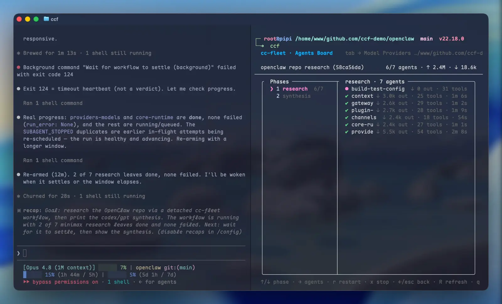
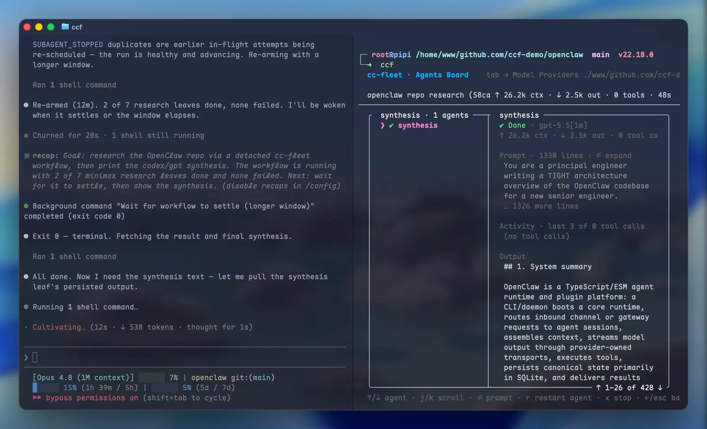
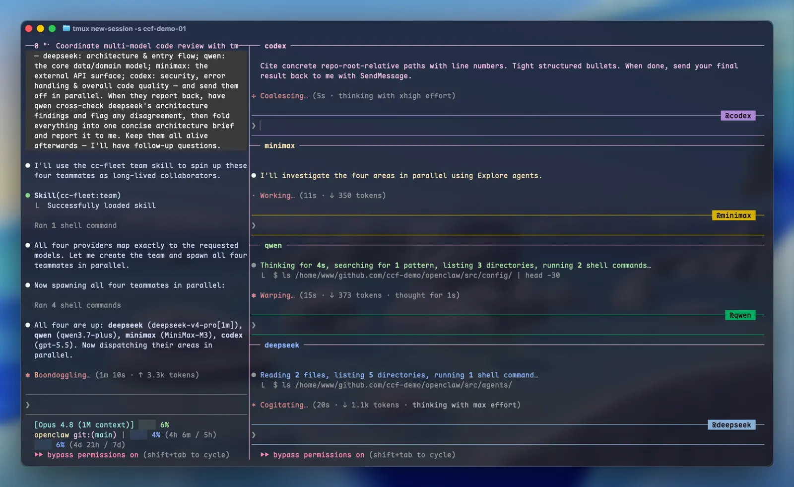
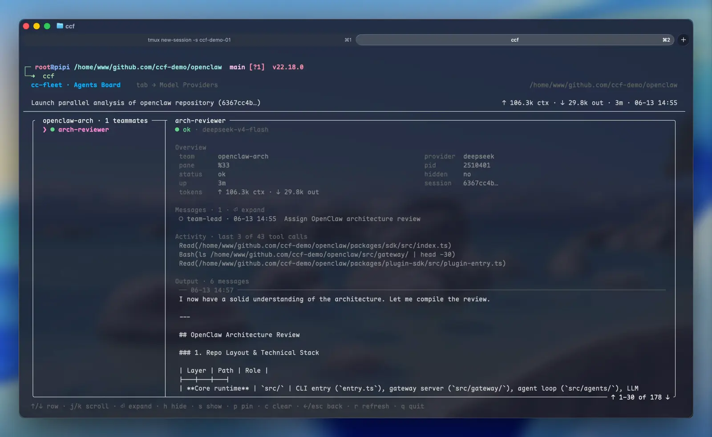
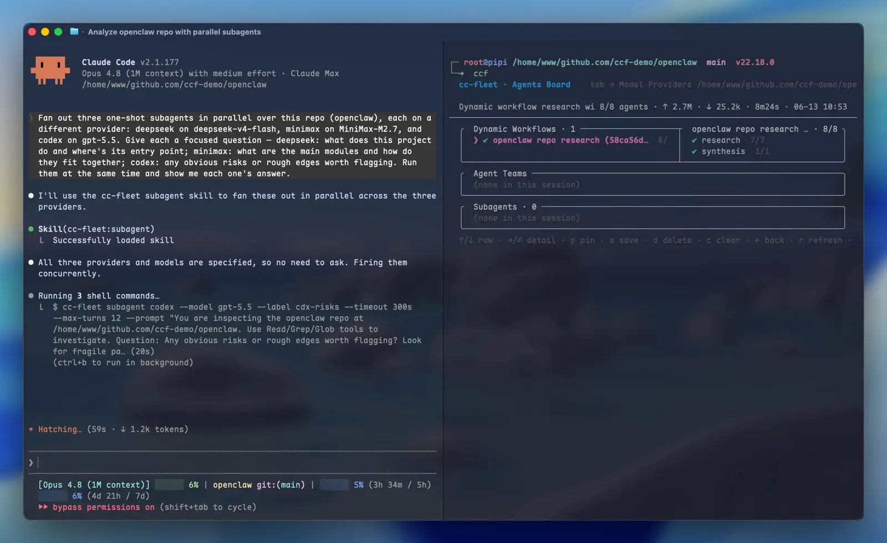
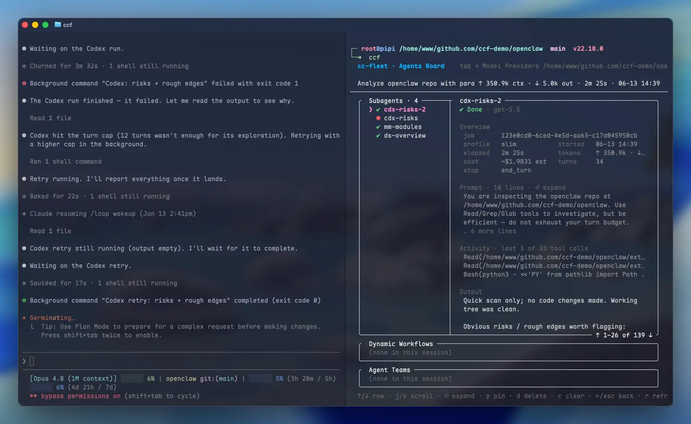
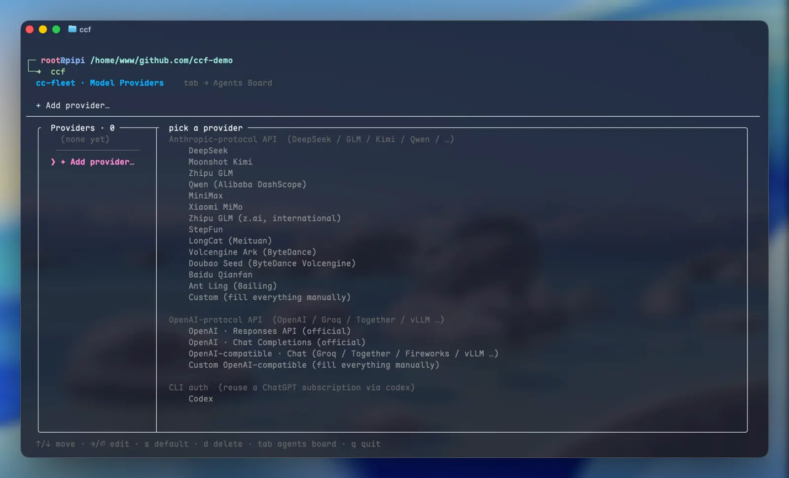
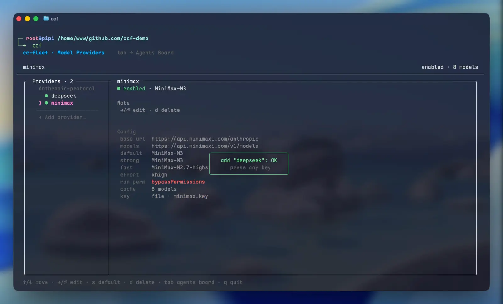
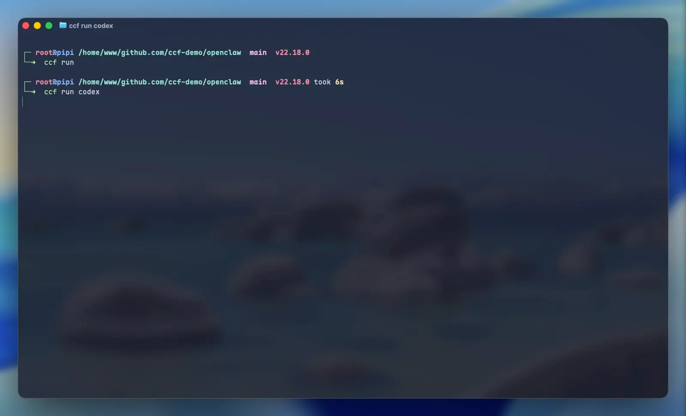
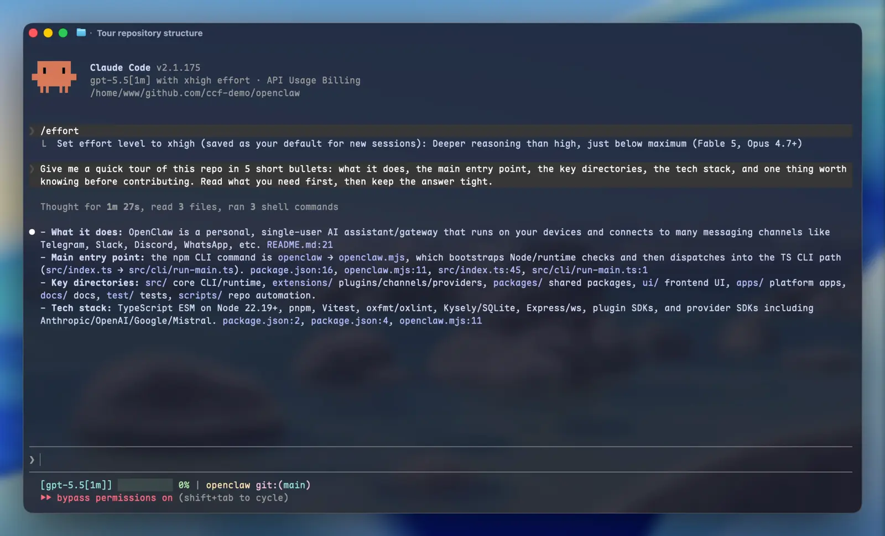

<h1 align="center">🚢 cc-fleet</h1>

<p align="center"><strong>🤖 为 Claude Code 的 ⚙️ Dynamic Workflow、👥 Agent Team、⚡ Subagent 接入任意第三方模型——从 DeepSeek · GLM · Kimi · Qwen……到你的 Codex 订阅,主会话原有认证不受影响;若没有 Claude 订阅,也能用任意 Provider 启动一个完整的 Claude Code 🚀</strong></p>

<div align="center">

[](https://github.com/ethanhq/cc-fleet/releases) [](https://www.npmjs.com/package/@ethanhq/cc-fleet) [](https://github.com/ethanhq/cc-fleet/releases) [](../LICENSE)

[English](../README.md) · **简体中文**

</div>

---

Claude Code 的多 agent 编排能力——Dynamic Workflow、Agent Team、Subagent——原本只能跑 Anthropic 自家的模型。cc-fleet 让任何提供 Anthropic 与 OpenAI 兼容 API 的模型,甚至你的 Codex 订阅,都能作为 Workflow leaf、长驻 Teammate 或一次性 Subagent 接入,由主会话直接调度,**身份与能力都与原生 Claude Agent 一致**。

每个第三方 worker 都是一个真实的 `claude` 进程,只是 LLM 后端换成了对应服务商,Claude Code 用驱动原生 agent 的方式驱动它即可。主会话自己的认证(OAuth 订阅或 API key)不受影响,第三方 key 绝不进入环境变量、argv 或 shell 历史——**无泄漏风险**。

**上手两步**:一键安装,配置一个 Provider。之后在 Claude Code 里用 `/workflow`、`/team`、`/subagent` 指定意图,或直接用自然语言描述任务——意图识别与 CLI 调用全部由 Claude 自行推理操作。

如果没有 Claude 订阅,`ccf run <provider>` 直接启动一个由该 Provider 驱动的交互式会话——**还是熟悉的 `claude`**,只是跑在对应的 Provider(供应商)模型上。

## 快速安装

**0. 先装 Claude Code**——cc-fleet 驱动的是官方 `claude` CLI,没装的话先装(PATH 上已有 `claude` 可跳过):

**macOS / Linux:**
```bash
curl -fsSL https://claude.ai/install.sh | bash
```
**Windows(PowerShell):**
```powershell
irm https://claude.ai/install.ps1 | iex
```

**1. 一键脚本装 cc-fleet(推荐)**——一条命令完成全部:下载并校验 CLI、写入 PATH(同时建立 `ccf` 别名,之后用 `ccf` 即可启动)、通过 marketplace 装好 Claude Code 插件(skill + 会话 hook),装完直接可用:

**macOS / Linux:**
```bash
curl -fsSL https://raw.githubusercontent.com/ethanhq/cc-fleet/main/install.sh | sh
```
**Windows(PowerShell):**
```powershell
irm https://raw.githubusercontent.com/ethanhq/cc-fleet/main/install.ps1 | iex
```

> 其他安装方式(npm / go install / Releases / 源码)、安装器覆盖参数、环境要求与维护,见 **[安装与维护](install.zh.md)**。

**常用命令:**

```bash
ccf                      # 唤起 TUI 交互面板
ccf doctor               # 体检:检查依赖、Provider、插件状态
ccf update               # 沿安装渠道自更新并刷新插件
ccf uninstall --all      # 连二进制、插件一起清空
```

装好后先运行 `ccf` 注册一个 Provider,即可开始委派。

## 快速上手
<table>
<tr>
<td width="50%" valign="top">
<div align="center">

**🔌 Provider 管理 - 输入 API Key 快速接入**


</div>

1. **`ccf` 进入 TUI**,选 Add provider
2. **选任意一家 Anthropic / OpenAI 兼容厂商**
3. **填 API Key 与默认模型**,可选配 effort 思考强度与 Claude 启动权限
4. **保存即用**;列表里可加多个模型启停切换,`s` 设默认、`d` 删除
5. **(按需)配 Codex**:复用已有 OAuth,或现场登录(ccf 自持一份凭证)

</td>
<td width="50%" valign="top">
<div align="center">

**🖥️ ccf run - 用任意 Provider 跑 Claude Code**


</div>

1. **`ccf run` 用默认 Provider 启动交互式 `claude`**,`ccf run <provider>` 指定其中一家
2. **全套工具、完整 REPL**;无需 Anthropic 订阅,不影响主会话登录状态
3. **进会话后随时切换**:`/model` 换模型、`/effort` 调思考强度、`Shift+Tab` 切权限

</td>
</tr>
<tr>
<td width="50%" valign="top">
<div align="center">

**⚙️ Dynamic Workflow - 与原生 workflows 一致的编排 API**


</div>

1. **`/workflow` 直接发起**,或一句话交给 Claude:「deepseek 摸每个模块,glm 逐个出审计清单,gpt 汇总」
2. **Claude 自动写成 JS 脚本丢到后台跑**,不占用你主会话 token
3. **`workflow wait` 阻塞到完成才退出**——事件驱动、无需轮询
4. **TUI 看板实时显示每个 leaf 与 phase 状态**,`x` 暂停 / `r` 重跑单个 leaf 或整个 phase

</td>
<td width="50%" valign="top">
<div align="center">

**👥 Agent Team - tmux 分屏里的原生 Claude 多 Agent 协作**


</div>

1. **`/team` 直接发起**,或一句话交给 Claude:「开 glm 和 deepseek 两个 teammate,各自总结强项再对比」
2. **每个 Teammate 是真 `claude` 进程**,在侧边 tmux pane 实时工作,可跨 Provider 混编、跨轮次追加任务
3. **TUI 看板里查每个 Teammate 的完整 inbox 与运行状态**;`h` 收纳 / `s` 展示 pane,可前台分屏或后台运行

</td>
</tr>
<tr>
<td width="50%" valign="top">
<div align="center">

**⚡ Subagent - 最轻量的一次性委派**


</div>

1. **`/subagent` 直接发起**,或一句话交给 Claude:「kimi、qwen、glm 三个 subagent 并行分到这三个文件」
2. **Claude 把模型跑起来、同步收结果**,可同时分发多个并行处理
3. **`slim-ro` 只读模式**:让 Provider 安全分析仓库而不改动代码
4. **TUI 看板里逐个查 job 的 prompt、回答与花费**

</td>
<td width="50%" valign="top">
<div align="center">

**📊 TUI 看板 - 整支舰队一屏运维**


</div>

1. **`ccf` 启动后按 `Tab` 进入 Agents Board**,所有 Workflow / Team / Subagent 按 project → session 一屏展开
2. **选中任意一支看详情**:Workflow 的 run → phase → leaf 进度树、Team 的 Teammate inbox,都能逐条下钻 prompt、回答与花费
3. **看板内直接操作**:`x` / `r` 停启、`p` 钉住防清理、`c` 清理已完成、`d` 删除、`h` / `s` 收纳 pane
4. **跑完的 Team 自动留档**,界面随系统明暗主题切换

</td>
</tr>
</table>

## 深入了解

cc-fleet 的能力分两类:

- **三条委派 lane**(Workflow / Agent Team / Subagent)——由 Claude 自动调度,你说清要做什么,skill 就替你选 lane、挑模型,无需手动指定。
- **Provider 与 `ccf run`**——你手动配置、直接使用的工具。

---

### ⚙️ Dynamic Workflow

<table>
<tr>
<td width="50%" align="center"><br/><sub>Agents Board:phase → leaf 进度树,各家模型并行</sub></td>
<td width="50%" align="center"><br/><sub>钻进单个 leaf:完整 prompt 与综合输出</sub></td>
</tr>
</table>

**编排 API**:多阶段编排写在一个 JavaScript 文件里,API 与 Claude Code 原生 Workflow 工具完全一致——用 `agent()` 起一个节点、`parallel()` 并行扇出、`pipeline()` 串成流水线。唯一的不同是 `agent()` 多了一个 `provider` 选项,用来给每个节点指派模型,各家模型可在同一个 run 里混搭并行:

```js
const meta = {
  name: "api audit",
  description: "先摸清各模块端点,再逐个起草审计清单",
  phases: [{ title: "map" }, { title: "build" }, { title: "judge" }],
};

phase("map");
const maps = (await parallel(
  ["auth", "billing", "users"].map((m) =>
    () => agent("列出模块 " + m + " 暴露的全部端点", { provider: "deepseek" }))
)).filter(Boolean);

phase("build");
const checklists = await pipeline(maps,
  (endpoints, _, i) => agent("基于这些端点起草审计清单:\n" + endpoints,
                             { provider: "glm", label: "build:" + i }));

phase("judge");
const verdict = await agent("选出最强的一份并说明理由:\n" + checklists.join("\n---\n"),
                            { provider: "claude", model: "opus", label: "judge" });
return { checklists, verdict };
```

**运行与管理**:发起后整个 run 在后台引擎里跑,用一组命令管理它的生命周期。run 按内容哈希记 journal,预算可按美元或 token 封顶:

```bash
RUN=$(ccf workflow run audit.js)            # 后台启动,只打印 run id
ccf workflow wait "$RUN" --timeout 10m      # 阻塞到完成,事件驱动
ccf workflow stop "$RUN" --leaf build:1     # 挂起单个 leaf(run 继续)
ccf workflow restart "$RUN" --leaf build:1  # 恢复它
ccf workflow run audit.js --resume "$RUN"   # 重放 journal,跑完的 leaf 命中缓存
```

**挂起与重启**:`ccf workflow stop --leaf` / `--phase` 不会让 run 失败,只是把指定的节点暂停——run 继续运行、其他节点照常推进,等你 `restart` 时再让它重新跑一遍。如果一个 run 里正在跑的节点全被暂停了,整个 run 会停在“搁置”状态,需要你手动处理后才能继续。

**等完成,不用轮询**:`ccf workflow wait` 会一直阻塞到 run 结束才退出——把它丢到后台,等它退出再回来看结果即可,不必反复查询。退出码直接说明结局:`0` 成功、`1` 失败、`3` 搁置待处理、`124` 等待超时(run 仍在运行)、`130` 被中断。

**预算自适应**:脚本里 `budget.spent()` / `budget.remaining()` 在运行中实时可读(美元或 token),工作流能据此自己决定还要不要再派下一批节点。

**混用自己的订阅**:指派 `provider: "claude"` 的节点跑在你**自己**的 Claude 登录上——上面的 `judge` 用的是你的订阅、不是 Provider key,适合留给汇总收尾这类关键节点。

---

### 👥 Agent Team

<table>
<tr>
<td width="50%" align="center"><br/><sub>tmux 里四个 teammate 并肩工作</sub></td>
<td width="50%" align="center"><br/><sub>看板里某个 teammate 的概览 / 消息 / 输出</sub></td>
</tr>
</table>

**前置要求**:Agent Team 是唯一需要提前配置的 lane,而且因为依赖 tmux,**暂不支持 Windows**。用前满足两个条件——

1. **进入一个 tmux 会话**(`tmux new-session -s work`),Teammate 的 pane 才能在你旁边分屏显示;
2. **启用 Claude Code 的 agent-teams**:首次运行 `ccf` 时会检测到未启用并提示你,可以让它自动写入,也可以自己在 `~/.claude/settings.json` 里加一次:

```json
{ "env": { "CLAUDE_CODE_EXPERIMENTAL_AGENT_TEAMS": "1" } }
```

**怎么协作**:每个 Teammate 都是真实的 `claude` 进程,Claude 用原生 `TeamCreate` 建队、`SendMessage` 给它派活,Teammate 跨轮次持续存活,可以不断追加任务。一个 team 里能同时用多家 Provider,再让某个 Teammate 把结果汇总比较。

**权限继承**:每个 Teammate 自动沿用你主会话的权限档位(plan / acceptEdits / default)。如果探测不到主会话的设置,会退回到最安全的默认权限,不会自动放开高危权限。

**收起与恢复**:`ccf hide` 把 Teammate 的 pane 收起来不占屏幕,但进程照常运行、消息收发和上下文都不丢,`ccf show` 再展开回来。收尾时 `ccf teardown` 会彻底清理掉所有相关进程,包括 pane 被关掉后仍在后台运行、继续消耗 key 的残留进程,不留偷偷计费的“幽灵”。

**不在 tmux 时**:Teammate 会跑在一个后台的 `cc-fleet-swarm-<team>` 会话里,流程完全一样,只是 pane 不显示在屏幕上。想查看,用 `tmux -L cc-fleet-swarm-<team> attach` 进去即可。

---

### ⚡ Subagent

<table>
<tr>
<td width="50%" align="center"><br/><sub>一句话 fan out 三个 subagent 并行</sub></td>
<td width="50%" align="center"><br/><sub>看板里的 job 列表与单个 job 详情(slim 档 / token / 输出)</sub></td>
</tr>
</table>

**三档运行模式**:默认 **slim** 档,发给模型的系统提示经过精简、工具范围也收窄,首次请求比完整会话小很多——对按 token 计费的 Provider 更省、更快。`--profile slim-ro` 是只读档,工具只剩查看类(Bash / Glob / Grep / Read / Skill),禁止新建、修改、删除文件,可以让 Provider 放心地读代码、查日志而不动你的工作区。需要完整会话能力时用 `--profile full`。

**工具裁剪与并行**:`--tools` 可以用逗号分隔的工具名整体指定要开放的工具(是替换、不是在默认基础上追加),`--skills=false` 关掉 Skill 工具,`--mcp` 控制是否沿用宿主的 MCP 配置。Subagent 不建 team、不占 pane、不加任何锁,同一个 Provider 同时跑多个互不影响,适合大批量并行。

**后台与唤醒**:长任务加 `--background` 转到后台,再用 `ccf subagent-status <job> --wait` 阻塞等待,任务一完成就会唤醒发起它的会话——不用反复查询。每个任务由花费(USD)、轮次、超时三道上限兜底,失败时返回固定的 `error_code` 方便程序判断。

**结构化结果**:加 `--json` 时,会输出一个字段固定的结果对象,方便脚本直接解析——除了答案文本,还包含实际应答的模型 id、本次花费、token 用量、轮次和 session_id。

**用自己的订阅跑关键节点**:和 Workflow 一样,把 Provider 指定为保留名 `claude`(`ccf subagent claude --model opus …`),就会用你自己的 Claude 登录、走你的订阅计费——适合留给汇总收尾,不要拿去做大批量并行。

---

### 🔌 Provider 管理

<table>
<tr>
<td width="50%" align="center"><br/><sub>内置预设一键选(13 家 Anthropic 协议 + OpenAI + Codex)</sub></td>
<td width="50%" align="center"><br/><sub>每个 Provider 的 default / strong / fast 档位与 key</sub></td>
</tr>
</table>

**广泛兼容**:支持任何 Anthropic 或 OpenAI 兼容的 API 端点——前者如 DeepSeek、Kimi、GLM、Qwen 等,后者如 Groq、Together、Fireworks、本地 vLLM,以及 OpenAI 官方。常见厂商都内置了预设,选中即填好端点与协议,省去手动录入;不在预设里的,选 *Custom* 填上地址即可。

**模型档位**:每个 Provider 可配 **default / strong / fast** 三个档位的模型,每档可单独标注 1M 上下文与推理 effort。这样 Claude 说"用 strong 模型"就行,无需硬编码具体模型 ID。`ccf default <provider>` 设全局默认 Provider,不指定时的调用都走它。

**多 API Key 轮换**:一个 Provider 可挂多把 API Key,按 `off` / `round_robin` / `random` 三种策略轮换,分摊额度、避开限流。

**API Key 保护**:Key 在每次请求时才被取用,只输出一次,不会写进环境变量、命令行参数或 shell 历史;worker 进程启动时会清掉主会话的凭证,两边互不串漏。本地保存时用 `0600` 权限只对你可读,也可以交给 `pass`、1Password、Vault、系统 keyring 托管;所有界面和日志里 Key 一律打码显示(`sk-…238`)。

**Codex(ChatGPT 订阅)**:一次设备码登录,ChatGPT 订阅就成了普通 Provider,Workflow / Team / Subagent / run 全部可用。

> [!WARNING]
> **Codex 属非官方用法。** 在 codex CLI 之外复用 ChatGPT 订阅可能违反 OpenAI 条款,`ccf codex login` 会先要求你明确确认。OAuth token 只存在于本地转换 daemon 内,cc-fleet 维护独立的登录链,不碰 codex CLI 的认证。

---

### 🖥️ ccf run

<table>
<tr>
<td width="50%" align="center"><br/><sub>一行启动:ccf run / ccf run codex</sub></td>
<td width="50%" align="center"><br/><sub>进去就是完整的 claude——这里跑在 gpt-5.5 上</sub></td>
</tr>
</table>

**启动**:`ccf run <provider>` 在指定 Provider 上开一个交互式 `claude`;不带 Provider 时(`ccf run`)解析到全局默认 Provider。

```bash
ccf run deepseek        # 一个跑在 DeepSeek 上、用 Provider key 计费的交互式 claude
```

**就是原生的 claude**:`ccf run` 不会在后台多挂一层进程——它直接把自己替换成 `claude`,cc-fleet 完全退场,之后就是一个纯粹的 `claude` 进程,体验和退出行为与你直接敲 `claude` 完全一样。

**自动隔离凭证**:即使你在一个已登录的 Claude Code 会话里运行它,也会先把环境里残留的 Anthropic 认证信息清空,改用对应 Provider 的鉴权——确保计费落到 Provider 的 Key 上,不会误用你自己的订阅。

**参数**:

- `--model strong / fast` —— 覆盖默认,用该 Provider 的强档或快档模型
- `--permission-mode` —— 设定权限档位
- `-- <claude 参数>` —— 后面的参数原样透传给底层 `claude`

> [!NOTE]
> 这条 lane 是给你手动交互用的,要求在真实终端里运行,不支持管道或重定向——需要非交互、一次性产出的场景请改用 Subagent。

## 文档

- **[CLI 参考与高级用法](cli.zh.md)**——每个命令、flag 与 envelope。
- **[编写 workflow 脚本](workflows.md)**——workflow lane 的 JS 编排 API(英文)。
- **[架构](architecture.md)**——spawn、key 安全、转换 daemon、workflow 引擎的真实工作方式(英文)。
- `cc-fleet <cmd> --help`——永远以它为准。

## 参与贡献

非常欢迎 PR——bug 修复、新 provider 预设、文档、测试、功能都好。请先读 **[贡献指南](../.github/CONTRIBUTING.md)**;几条基本规则:

- **界面改动和 bug 修复**需要在 PR 里**附截图或 GIF**。
- **AI *辅助***的提交,用 `Co-Authored-By` trailer 注明工具。
- **完全由 AI *生成***的 PR,在 PR body 末尾加自动化 PR 标注。

## 许可证

[Apache-2.0](../LICENSE)。
